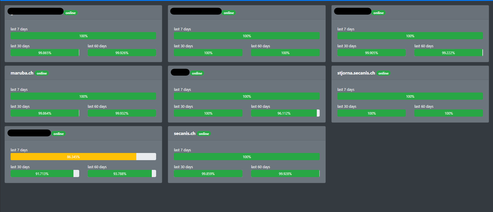

# Dashboard with UpTimeRobot API

This dashboard was created based on the [Uptime Robot Service](https://uptimerobot.com/).
You can create there an account for free and access on the the data by the REST API.

This project uses the [Balena Cloud](https://www.balena.io/cloud) to deploy this stuff on a raspberry.
But you can also use the app-part standalone as a normal Node application.



## Setup / Development for the Node app (dashboard)

    cd app
    npm install
    npm start
    // > app is served on http://localhost:3000

### Configuration for development (or optional for deployment)

You can use for example a config file. The file should be named `config.js` and has to be in the root folder, near the `server.js`.
This config file is read at server startup.

```
module.exports = {
    initialize: () => {
        process.env.UPTIME_ROBOT_API_KEY = '{insert your uptime robot api key here...}';
    },
    isProduction: () => {
        return process.env.NODE_ENV === 'production';
    }
};
```

## Balena Setup

If you wanna use the hole Balena setup you can setup a development application for free on [http://balena-cloud.com](http://balena-cloud.com). After that you can setup your first Raspberry, following the guide on Balena.
After that you can clone this repository and add the remote repository which is noted on the top right in the Balena Cloud Dashboard.

As soon you have added the Balena remote repo you can push this/your project to Balena:

    git push balena master --force

The project and the Docker containeres will be built and automaticall deployed your connected Raspberry.

For working properly you have to set the following two ENV variables on the Balena Cloud Dashboard:

    NODE_ENV=production
    UPTIME_ROBOT_API_KEY={yourUptimeRobotAPIKey}
    
### Fleet / Device Configuration

I set the `Define device GPU memory in megabytes` config in the Balena Cloud UI to 128MB to increase GPU performance.

## Credits

- [Raspberry Pi](https://www.raspberrypi.org/)
- [Balena Cloud](https://www.balena.io/)
- [UptimeRobot](https://uptimerobot.com/)

For the dashboard:

- [DisplayJS](https://display.js.org/)
- [Bootstrap](https://getbootstrap.com/)
- and much more... hava a look in the packge.json
